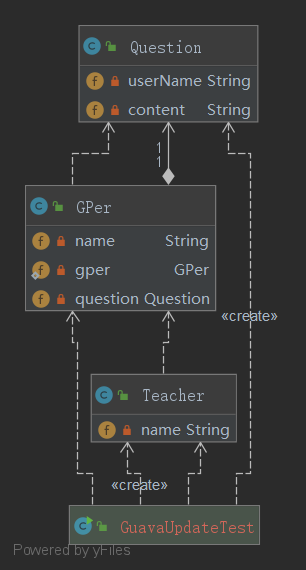

# 设计模式Demo

## 装饰者模式

### 定义
    装饰者模式（Decorator Pattern）是指在不改变原有对象的基础之上，将功能附加到对象上，提供了比继承更有弹性的替代方案（扩展原有对象的功能）。
    属于结构型模式
   
### 装饰者模式类图

### 装饰者模式的适用场景

    1、用于扩展一个类的功能或给一个类添加附加职责。
    2、动态的给一个对象添加功能，这些功能可以再动态的撤销。

### 装饰者模式的和适配器模式对比

<table>
        <tr>
            <th></th>
            <th>装饰者模式</th>
            <th>适配器模式</th>
        </tr>
        <tr>
            <th>形式</th>
            <th>是一种非常特别的适配器模式</th>
            <th>没有层级关系，装饰器模式有层级关系</th>
        </tr>
        <tr>
            <th>定义</th>
            <th>装饰者和被装饰者都实现同一个接口，主
            要目的是为了扩展之后依旧保留OOP关系</th>
            <th>适配器和被适配者没有必然的联系，通
            常是采用继承或代理的形式进行包装</th>
        </tr>
        <tr>
            <th>关系</th>
            <th>满足is-a的关系</th>
            <th>满足has-a的关系</th>
        </tr>
        <tr>
            <th>功能</th>
            <th>注重覆盖、扩展</th>
            <th>注重兼容、转换</th>
        </tr>
        <tr>
            <th>设计</th>
            <th>前置考虑</th>
            <th>后置考虑</th>
        </tr>
    </table>

### 装饰者模式的优缺点

> 优点
   1、装饰者是继承的有力补充，比继承灵活，不改变原有对象的情况下动态地给一个对象扩展功能，即插即用。
   2、通过使用不同装饰类以及这些装饰类的排列组合，可以实现不同效果。
   3、装饰者完全遵守开闭原则。

> 缺点
    1、会出现更多的代码，更多的类，增加程序复杂性。
    2、动态装饰时，多层装饰时会更复杂。

### 观察者模式
 
 ### 定义
     
     观察者模式（Observer Pattern）定义了对象之间的一对多依赖，让多个观察者对象同时监听一个主体对象，当主体对象发生变化时，它的所有依赖者（观察者）都会收到通知并更新。
     属于行为型模式。
     观察者模式有时也叫做发布订阅模式。
    
 ### 观察者模式类图
 
 
 
 

### 观察者模式的适用场景

    观察者模式主要用于在关联行为之间建立一套触发机制的场景。
    
### 观察者模式的优缺点

> 优点
    1、观察者和被观察者之间建立了一个抽象的耦合。
    2、观察者模式支持广播通信。

> 缺点
    1、观察者之间有过多的细节依赖、提高时间消耗及程序的复杂度。
    2、使用要得当，要避免循环调用。
    
    
